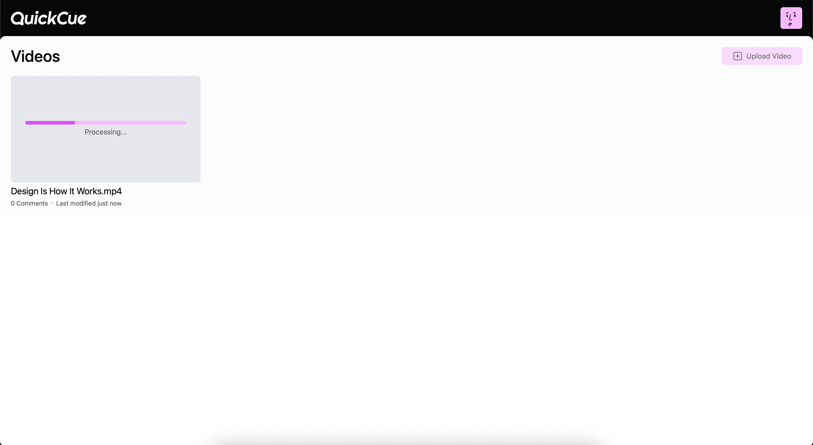
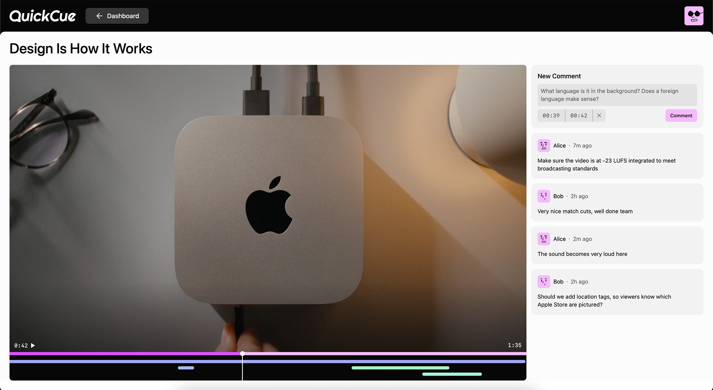
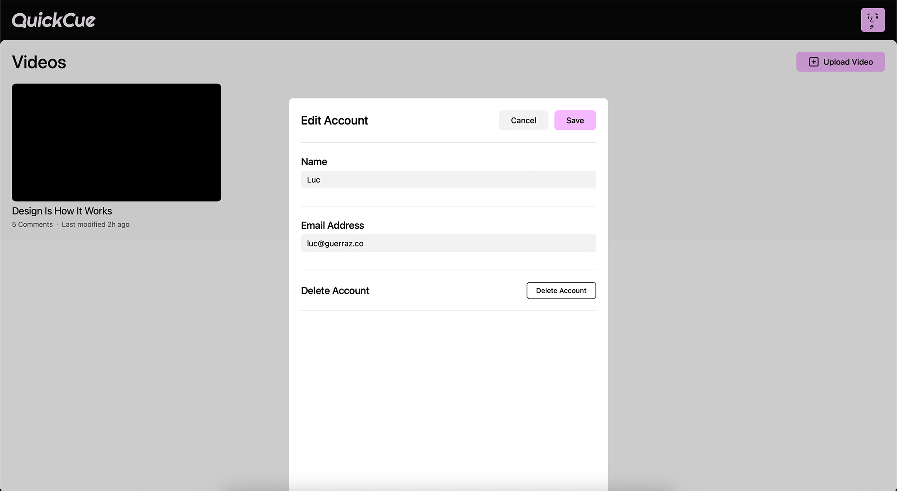

# QuickCue – A Video Feedback App

**Inspired by Frame.io and having previously worked in a corporate communications team producing videos, I created a tool that allows users to easily add timestamped comments & feedback on produced videos.**

After uploading the video, the video is processed with ffmpeg into an mpeg-dash stream to ensure smooth playback on any device with any internet connection. A unique URL is then generated that can be shared to receive feedback on the uploaded video.

Users can then watch the video and add comments including a timestamp or even a time range to let the video producer know exactly what he means.

## Demo

Explore the demo here: [https://quickcue.guerraz.co](https://quickcue.guerraz.co). To add comments of your own, you can log in using any email address and you'll receive a one-time passcode.

## Screenshots

Processing the video after uploading it

Adding a comment on a video

Editing account settings
